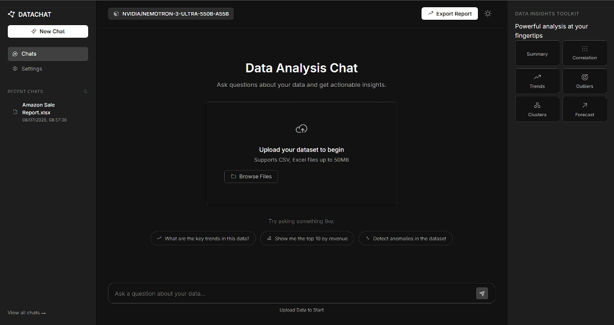

# DataChat


DataChat is an intelligent, conversational data analysis platform. It allows users to upload datasets (CSV, Excel) and chat with an AI assistant to extract insights, generate charts, and summarize data dynamically. 

##  Application Interface



## How It Works

1. **Upload Data:** Users drag-and-drop a `.csv` or `.xlsx` file into the interface.
2. **AI Processing:** The backend uses LangChain's `create_pandas_dataframe_agent` to ingest the dataset into a Pandas DataFrame.
3. **Conversational Insights:** Users ask questions in natural language (e.g., *"Show me the top 10 products by revenue"* or *"Plot a bar chart of monthly sales"*).
4. **Execution & Visualization:** The AI interprets the intent, writes the required Python code using Pandas, executes it safely to find the answer, and generates Matplotlib charts.
5. **Report Generation:** Users can export the entire conversation and generated visual insights into a professional PDF report.

## Architecture & Approach

DataChat is designed with a **Separated Architecture**, splitting the frontend and backend to optimize deployment and scalability.

### Frontend
- **Tech:** HTML, CSS, Vanilla JavaScript.
- **Approach:** We avoided heavy frameworks to ensure extreme performance and simplicity. The frontend features a sleek, monochrome design (supporting both light and dark modes) and dynamically communicates with the backend via asynchronous `fetch` API calls.
- **Hosting:** Configured for **Vercel** as a static site using `vercel.json` for custom routing.

### Backend
- **Tech:** Python, FastAPI, LangChain, SQLite/PostgreSQL.
- **Approach:** FastAPI provides an incredibly fast asynchronous server. The core logic relies on **LangChain** and Large Language Models (LLMs like OpenAI or NVIDIA models) to act as an agent that reasons over data.
- **Data Persistence:** Uploaded files and generated charts are saved to the server disk. Chat histories are saved in a SQL database (SQLite for local development, dynamically switching to PostgreSQL via the `DATABASE_URL` environment variable for production).
- **Security:** We implemented robust CORS policies using FastAPI's `CORSMiddleware` to allow the Vercel frontend to securely query the API.
- **Hosting:** Configured for **Render** (or similar containerized platforms) as a stateful Web Service with a Persistent Disk.

## Key Challenges Solved

- **Agent Context Limits:** We faced issues where the LLM agent would fail after multiple turns because the conversational history became too large. We solved this by implementing selective memory handling and strict token limits, ensuring the agent remains focused on the immediate data task.
- **Dependency Conflicts:** Balancing `langchain-experimental`, newer `pydantic` versions, and `openai` clients caused environment crashes. We systematically resolved versioning conflicts to stabilize the Python environment.
- **Stateful Deployment:** Standard serverless deployments (like Vercel) destroy local files, breaking file uploads and chart generation. We designed a dual-deployment strategy (Vercel + Render) so the stateful Python backend could securely store data while the frontend remains globally distributed.

## Local Setup

### 1. Prerequisites
*   **Python 3.9+**

### 2. Installation
```bash
git clone https://github.com/saimaniippili/Datachat.git
cd Datachat
pip install -r requirements.txt
```

### 3. Running the App
```bash
python src/main.py
```
*This will start the local server and automatically open the DataChat UI in your web browser at `http://127.0.0.1:8000`.*

##  Usage

1.  **Upload Data:** Drag and drop or click to choose your CSV or Excel file on the left sidebar.
2.  **Start Chatting:** Type your questions about the data in the chat input box at the bottom.
3.  **Get Answers:** DataChat will process your question and display the answer, complete with any generated charts!

##  Examples

*   "What is the average age of customers?"
*   "How many sales were made in each region?"
*   "Which product category has the highest revenue?"
*   "Show me a histogram of customer ages."

##  License
This project is licensed under the Apache 2.0 License.
